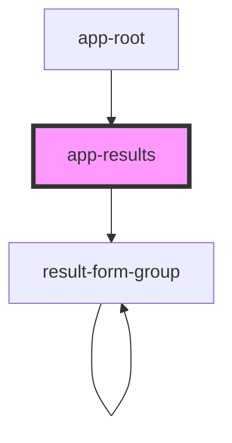

# app-results

<!-- Auto Generated Below -->

## Properties

| Property        | Attribute | Description | Type    | Default     |
| --------------- | --------- | ----------- | ------- | ----------- |
| `searchResults` | --        |             | `any[]` | `undefined` |

## Dependencies

### Used by

 - [app-root](..\app-root)

### Depends on

- [result-form-group](..\result-form-group)

### Graph

----------------------------------------------

*Built with [StencilJS](https://stenciljs.com/)*
